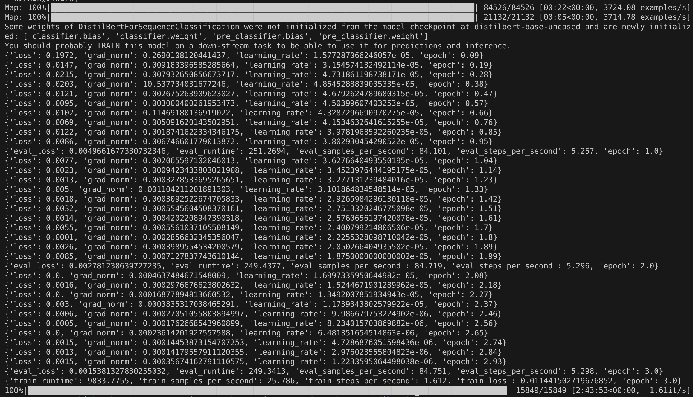
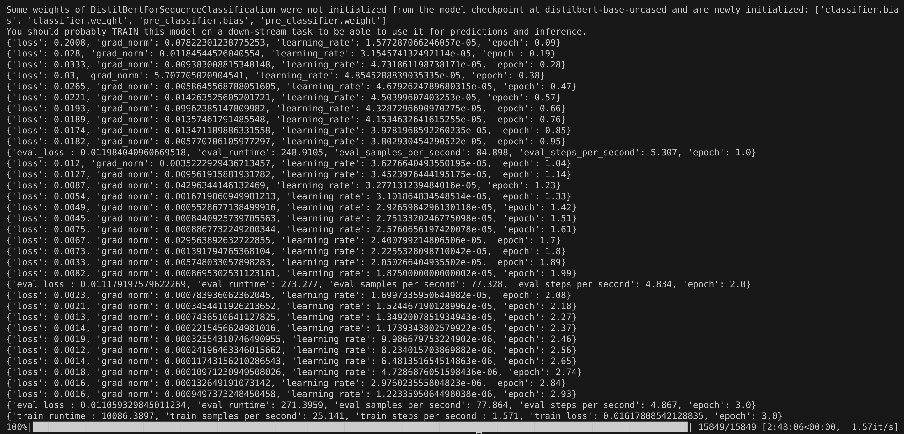

# 训练结果

## 第一次：

```bash
Map: 100%|████████████████████████████████████████████████████████████████████████████████████████████| 84526/84526 [00:22<00:00, 3724.08 examples/s]
Map: 100%|████████████████████████████████████████████████████████████████████████████████████████████| 21132/21132 [00:05<00:00, 3714.78 examples/s]
Some weights of DistilBertForSequenceClassification were not initialized from the model checkpoint at distilbert-base-uncased and are newly initialized: ['classifier.bias', 'classifier.weight', 'pre_classifier.bias', 'pre_classifier.weight']
You should probably TRAIN this model on a down-stream task to be able to use it for predictions and inference.
{'loss': 0.1972, 'grad_norm': 0.2690108120441437, 'learning_rate': 1.577287066246057e-05, 'epoch': 0.09}                                             
{'loss': 0.0147, 'grad_norm': 0.009183396585285664, 'learning_rate': 3.154574132492114e-05, 'epoch': 0.19}                                           
{'loss': 0.0215, 'grad_norm': 0.007932650856673717, 'learning_rate': 4.731861198738171e-05, 'epoch': 0.28}                                           
{'loss': 0.0203, 'grad_norm': 10.537734031677246, 'learning_rate': 4.8545288839035335e-05, 'epoch': 0.38}                                            
{'loss': 0.0121, 'grad_norm': 0.002675263909623027, 'learning_rate': 4.6792624789680315e-05, 'epoch': 0.47}                                          
{'loss': 0.0095, 'grad_norm': 0.003000400261953473, 'learning_rate': 4.50399607403253e-05, 'epoch': 0.57}                                            
{'loss': 0.0102, 'grad_norm': 0.11469180136919022, 'learning_rate': 4.3287296690970275e-05, 'epoch': 0.66}                                           
{'loss': 0.0069, 'grad_norm': 0.005091620143502951, 'learning_rate': 4.1534632641615255e-05, 'epoch': 0.76}                                          
{'loss': 0.0122, 'grad_norm': 0.0018741622334346175, 'learning_rate': 3.9781968592260235e-05, 'epoch': 0.85}                                         
{'loss': 0.0086, 'grad_norm': 0.006746601779013872, 'learning_rate': 3.802930454290522e-05, 'epoch': 0.95}                                           
{'eval_loss': 0.0049661677330732346, 'eval_runtime': 251.2694, 'eval_samples_per_second': 84.101, 'eval_steps_per_second': 5.257, 'epoch': 1.0}      
{'loss': 0.0077, 'grad_norm': 0.002065597102046013, 'learning_rate': 3.6276640493550195e-05, 'epoch': 1.04}                                          
{'loss': 0.0023, 'grad_norm': 0.0009423433803021908, 'learning_rate': 3.4523976444195175e-05, 'epoch': 1.14}                                         
{'loss': 0.0013, 'grad_norm': 0.0003278533695265651, 'learning_rate': 3.277131239484016e-05, 'epoch': 1.23}                                          
{'loss': 0.005, 'grad_norm': 0.001104211201891303, 'learning_rate': 3.101864834548514e-05, 'epoch': 1.33}                                            
{'loss': 0.0018, 'grad_norm': 0.0003092522674705833, 'learning_rate': 2.9265984296130118e-05, 'epoch': 1.42}                                         
{'loss': 0.0032, 'grad_norm': 0.0005545604508370161, 'learning_rate': 2.7513320246775098e-05, 'epoch': 1.51}                                         
{'loss': 0.0014, 'grad_norm': 0.0004202208947390318, 'learning_rate': 2.5760656197420078e-05, 'epoch': 1.61}                                         
{'loss': 0.0055, 'grad_norm': 0.0005561037105508149, 'learning_rate': 2.400799214806506e-05, 'epoch': 1.7}                                           
{'loss': 0.0001, 'grad_norm': 0.0002856632345356047, 'learning_rate': 2.2255328098710042e-05, 'epoch': 1.8}                                          
{'loss': 0.0026, 'grad_norm': 0.0003989554534200579, 'learning_rate': 2.050266404935502e-05, 'epoch': 1.89}                                          
{'loss': 0.0085, 'grad_norm': 0.0007127837743610144, 'learning_rate': 1.8750000000000002e-05, 'epoch': 1.99}                                         
{'eval_loss': 0.002781238639727235, 'eval_runtime': 249.4377, 'eval_samples_per_second': 84.719, 'eval_steps_per_second': 5.296, 'epoch': 2.0}       
{'loss': 0.0, 'grad_norm': 0.0004637484671548009, 'learning_rate': 1.6997335950644982e-05, 'epoch': 2.08}                                            
{'loss': 0.0016, 'grad_norm': 0.0002976676623802632, 'learning_rate': 1.5244671901289962e-05, 'epoch': 2.18}                                         
{'loss': 0.0, 'grad_norm': 0.00016877894813660532, 'learning_rate': 1.3492007851934943e-05, 'epoch': 2.27}                                           
{'loss': 0.003, 'grad_norm': 0.0003835317038465291, 'learning_rate': 1.1739343802579922e-05, 'epoch': 2.37}                                          
{'loss': 0.0006, 'grad_norm': 0.00027051055803894997, 'learning_rate': 9.986679753224902e-06, 'epoch': 2.46}                                         
{'loss': 0.0005, 'grad_norm': 0.0001762668543960899, 'learning_rate': 8.234015703869882e-06, 'epoch': 2.56}                                          
{'loss': 0.0, 'grad_norm': 0.00023614201927557588, 'learning_rate': 6.481351654514863e-06, 'epoch': 2.65}                                            
{'loss': 0.0015, 'grad_norm': 0.00014453873154707253, 'learning_rate': 4.7286876051598436e-06, 'epoch': 2.74}                                        
{'loss': 0.0013, 'grad_norm': 0.00014179557911120355, 'learning_rate': 2.976023555804823e-06, 'epoch': 2.84}                                         
{'loss': 0.0015, 'grad_norm': 0.00035674162791110575, 'learning_rate': 1.2233595064498038e-06, 'epoch': 2.93}                                        
{'eval_loss': 0.0015381327830255032, 'eval_runtime': 249.3413, 'eval_samples_per_second': 84.751, 'eval_steps_per_second': 5.298, 'epoch': 3.0}      
{'train_runtime': 9833.7755, 'train_samples_per_second': 25.786, 'train_steps_per_second': 1.612, 'train_loss': 0.011441502719676852, 'epoch': 3.0}  
100%|████████████████████████████████████████████████████████████████████████████████████████████████████████| 15849/15849 [2:43:53<00:00,  1.61it/s]
```

## 第三次：



```bash
zrz@zrz-Lenovo-ThinkBook-16p-Gen-4:~/Projects/Python_Projects/VSCode/Python/Data_filter$ /home/zrz/Projects/Python_Projects/VSCode/Python/Data_filter/.venv/bin/python /home/zrz/Projects/Python_Projects/VSCode/Python/Data_filter/s3_BERT.py
/home/zrz/Projects/Python_Projects/VSCode/Python/Data_filter/.venv/lib/python3.10/site-packages/transformers/tokenization_utils_base.py:1601: FutureWarning: `clean_up_tokenization_spaces` was not set. It will be set to `True` by default. This behavior will be depracted in transformers v4.45, and will be then set to `False` by default. For more details check this issue: https://github.com/huggingface/transformers/issues/31884
  warnings.warn(
Map: 100%|████████████████████████████████████████████████████████████████████████████████████████████████████████████████| 84526/84526 [00:22<00:00, 3708.39 examples/s]
Map: 100%|████████████████████████████████████████████████████████████████████████████████████████████████████████████████| 21132/21132 [00:05<00:00, 3789.53 examples/s]
Some weights of DistilBertForSequenceClassification were not initialized from the model checkpoint at distilbert-base-uncased and are newly initialized: ['classifier.bias', 'classifier.weight', 'pre_classifier.bias', 'pre_classifier.weight']
You should probably TRAIN this model on a down-stream task to be able to use it for predictions and inference.
{'loss': 0.2008, 'grad_norm': 0.07822301238775253, 'learning_rate': 1.577287066246057e-05, 'epoch': 0.09}                                                                
{'loss': 0.028, 'grad_norm': 0.01184544526040554, 'learning_rate': 3.154574132492114e-05, 'epoch': 0.19}                                                                 
{'loss': 0.0333, 'grad_norm': 0.009383008815348148, 'learning_rate': 4.731861198738171e-05, 'epoch': 0.28}                                                               
{'loss': 0.03, 'grad_norm': 5.707705020904541, 'learning_rate': 4.8545288839035335e-05, 'epoch': 0.38}                                                                   
{'loss': 0.0265, 'grad_norm': 0.0058645568788051605, 'learning_rate': 4.6792624789680315e-05, 'epoch': 0.47}                                                             
{'loss': 0.0221, 'grad_norm': 0.014263525605201721, 'learning_rate': 4.50399607403253e-05, 'epoch': 0.57}                                                                
{'loss': 0.0193, 'grad_norm': 0.09962385147809982, 'learning_rate': 4.3287296690970275e-05, 'epoch': 0.66}                                                               
{'loss': 0.0189, 'grad_norm': 0.01357461791485548, 'learning_rate': 4.1534632641615255e-05, 'epoch': 0.76}                                                               
{'loss': 0.0174, 'grad_norm': 0.013471189886331558, 'learning_rate': 3.9781968592260235e-05, 'epoch': 0.85}                                                              
{'loss': 0.0182, 'grad_norm': 0.005770706105977297, 'learning_rate': 3.802930454290522e-05, 'epoch': 0.95}                                                               
{'eval_loss': 0.011984040960669518, 'eval_runtime': 248.9105, 'eval_samples_per_second': 84.898, 'eval_steps_per_second': 5.307, 'epoch': 1.0}                           
{'loss': 0.012, 'grad_norm': 0.0035222929436713457, 'learning_rate': 3.6276640493550195e-05, 'epoch': 1.04}                                                              
{'loss': 0.0127, 'grad_norm': 0.009561915881931782, 'learning_rate': 3.4523976444195175e-05, 'epoch': 1.14}                                                              
{'loss': 0.0087, 'grad_norm': 0.04296344146132469, 'learning_rate': 3.277131239484016e-05, 'epoch': 1.23}                                                                
{'loss': 0.0054, 'grad_norm': 0.0016719060949981213, 'learning_rate': 3.101864834548514e-05, 'epoch': 1.33}                                                              
{'loss': 0.0049, 'grad_norm': 0.0005528677138499916, 'learning_rate': 2.9265984296130118e-05, 'epoch': 1.42}                                                             
{'loss': 0.0045, 'grad_norm': 0.0008440925739705563, 'learning_rate': 2.7513320246775098e-05, 'epoch': 1.51}                                                             
{'loss': 0.0075, 'grad_norm': 0.0008867732249200344, 'learning_rate': 2.5760656197420078e-05, 'epoch': 1.61}                                                             
{'loss': 0.0067, 'grad_norm': 0.029563892632722855, 'learning_rate': 2.400799214806506e-05, 'epoch': 1.7}                                                                
{'loss': 0.0073, 'grad_norm': 0.001391794765368104, 'learning_rate': 2.2255328098710042e-05, 'epoch': 1.8}                                                               
{'loss': 0.0033, 'grad_norm': 0.005748033057898283, 'learning_rate': 2.050266404935502e-05, 'epoch': 1.89}                                                               
{'loss': 0.0082, 'grad_norm': 0.0008695302531123161, 'learning_rate': 1.8750000000000002e-05, 'epoch': 1.99}                                                             
{'eval_loss': 0.011179197579622269, 'eval_runtime': 273.277, 'eval_samples_per_second': 77.328, 'eval_steps_per_second': 4.834, 'epoch': 2.0}                            
{'loss': 0.0023, 'grad_norm': 0.000783936062362045, 'learning_rate': 1.6997335950644982e-05, 'epoch': 2.08}                                                              
{'loss': 0.0021, 'grad_norm': 0.0003454411926213652, 'learning_rate': 1.5244671901289962e-05, 'epoch': 2.18}                                                             
{'loss': 0.0013, 'grad_norm': 0.0007436510641127825, 'learning_rate': 1.3492007851934943e-05, 'epoch': 2.27}                                                             
{'loss': 0.0014, 'grad_norm': 0.0002215456624981016, 'learning_rate': 1.1739343802579922e-05, 'epoch': 2.37}                                                             
{'loss': 0.0019, 'grad_norm': 0.00032554310746490955, 'learning_rate': 9.986679753224902e-06, 'epoch': 2.46}                                                             
{'loss': 0.0012, 'grad_norm': 0.00024196463346015662, 'learning_rate': 8.234015703869882e-06, 'epoch': 2.56}                                                             
{'loss': 0.0014, 'grad_norm': 0.00011743156210286543, 'learning_rate': 6.481351654514863e-06, 'epoch': 2.65}                                                             
{'loss': 0.0018, 'grad_norm': 0.00010971230949508026, 'learning_rate': 4.7286876051598436e-06, 'epoch': 2.74}                                                            
{'loss': 0.0016, 'grad_norm': 0.000132649191073142, 'learning_rate': 2.976023555804823e-06, 'epoch': 2.84}                                                               
{'loss': 0.0016, 'grad_norm': 0.0009497373248450458, 'learning_rate': 1.2233595064498038e-06, 'epoch': 2.93}                                                             
{'eval_loss': 0.011059329845011234, 'eval_runtime': 271.3959, 'eval_samples_per_second': 77.864, 'eval_steps_per_second': 4.867, 'epoch': 3.0}                           
{'train_runtime': 10086.3897, 'train_samples_per_second': 25.141, 'train_steps_per_second': 1.571, 'train_loss': 0.01617808542128835, 'epoch': 3.0}                      
100%|████████████████████████████████████████████████████████████████████████████████████████████████████████████████████████████| 15849/15849 [2:48:06<00:00,  1.57it/s]
```

