# 论文笔记

# SrcMarker

## 实现思路

### Transformer

#### 总述

整体变换逻辑位于`./mutable_tree/tree_manip/visitors`目录下：

| 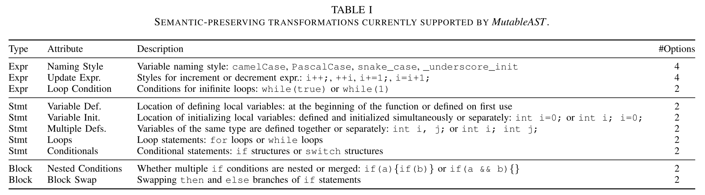 |
| :----------------------------------------------------------: |

##### ==注意==

如果想屏蔽掉一些上述的代码转换风格，只采用你选定的代码转换去添加水印：

> 可以在：`mutable_tree/transformers/utils.py`中将你想屏蔽掉的转换风格注释掉即可：
> 
>| 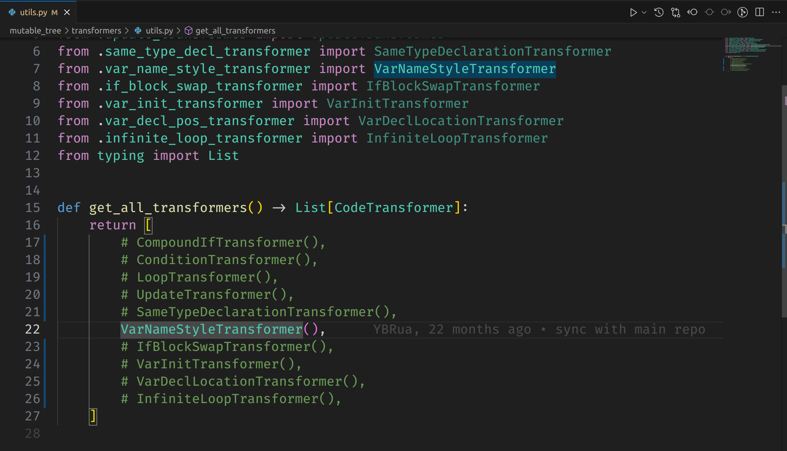 |
> | ------------------------------------------------------------ |
> 
>上面这部分在训练过程中并未使用...
> 
>同时在`train_main.py`中注释掉如下部分即可：
> 
>| 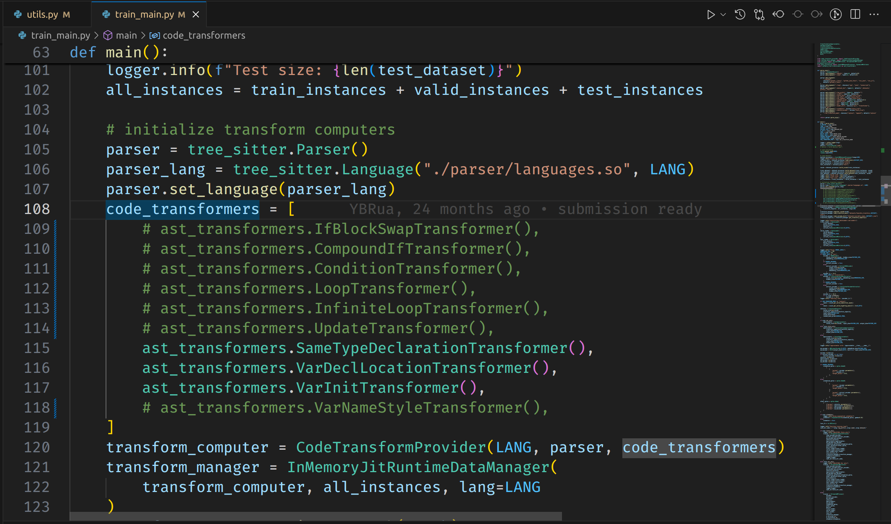 |
> | ------------------------------------------------------------ |
> 
>KeyError: ('IfBlockSwapTransformer.normal', 'CompoundIfTransformer.if_compound', 'ConditionTransformer.switch', 'LoopTransformer.for_loop', 'InfiniteLoopTransformer.literal_true', 'UpdateTransformer.prefix_update', 'SameTypeDeclarationTransformer.split', 'VarDeclLocationTransformer.block_start', 'VarInitTransformer.split', 'VarNameStyleTransformer.pascal_case')

- 为保证不影响整个项目的运行逻辑，我们找到代码进行转换的源头：

  也就是`mutable_tree/tree_manip/visitors`和`mutable_tree/transformers`这里

  为最小化修改代价同时保证正常运行，将没有选择的变换置空转，即让其失效：

  在`mutable_tree/transformers`路径下的各个转换模块中，让`mutable_tree_transform`函数直接返回`node`即可：

  ```python
  def mutable_tree_transform(self, node: Node, dst_style: str):
      # return {
      #     self.TRANSFORM_COND_SWITCH: SwitchToIfVisitor(),
      #     self.TRANSFORM_COND_TERNARY: TernaryToIfVisitor(),
      # }[dst_style].visit(node)
      
      return node
  ```

  | 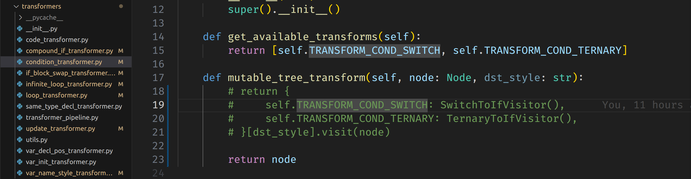 |
  | ------------------------------------------------------------ |

- 同时也可以屏蔽掉模型自适应重命名变量的模块

  该模块位于`trainers/ultimate_var_trainer.py`这里，调用了：
  `self.transform_manager.varname_transform_on_instances`模块

  只需要将`runtime_data_manager.py`中的这个模块做如下修改：

  ```python
  def varname_transform_on_instances(
      self, instances: List[DataInstance], word_preds: List[int], mode: str
  ) -> Tuple[List[DataInstance], List[Tuple[str, str]]]:
      assert self.vocab is not None
  
      new_instances = []
      updates = []
      for instance, word_pred in zip(instances, word_preds):
          new_word = self.vocab.get_token_by_id(word_pred)
          new_instance, update = self._jit_varname_substitution(
             instance, new_word, mode=mode
          )
          new_instances.append(new_instance)
          updates.append(update)
  
      # return new_instances, updates
      return instances, [("", "") for _ in instances]
  	# 这里如果返回的是空列表[]的话，会导致后面eval_main.py脚本执行logger.info(f"Variable Updates: {updates[i]}")时报错
  ```
  
  | 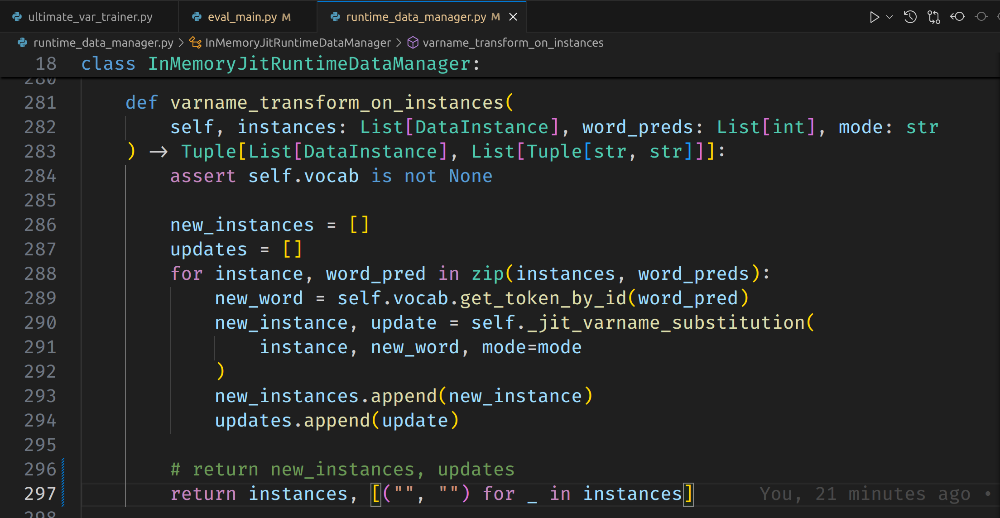 |
  | ------------------------------------------------------------ |


然后再训练模型并进行模型评估：（训练时的epoch可以适当小些）

```python
# training a 4-bit GRU model on CSN-Java
python train_main.py \
    --lang=java \
    --dataset=csn_java \
    --dataset_dir=./datasets/csn_java \
    --n_bits=4 \
    --epochs=25 \
    --log_prefix=4bit_gru_srcmarker \
    --batch_size 64 \
    --model_arch=gru \
    --shared_encoder \
    --varmask_prob 0.5 \
    --seed 42

# run an evaluation on CSN-Java, using some 4-bit GRU checkpoints
python eval_main.py \
    --checkpoint_path <path_to_model_checkpoint> \
    --lang java \
    --dataset csn_java \
    --dataset_dir ./datasets/csn_java \
    --n_bits 4 \
    --model_arch=gru \
    --shared_encoder \
    --write_output
```


#### 变量处理风格

##### [变量命名风格](ToCamelCaseVisitor(), ToPascalCaseVisitor(), ToSnakeCaseVisitor(), ToUnderscoreCaseVisitor())

- CamelCase：

  驼峰命名法：首个单词首字母小写，后续单词首字母大写，单词之间不使用分隔符。

- PascalCase：

  帕斯卡命名法，大驼峰：每个单词首字母都大写，单词之间不使用分隔符。

- SnakeCase：

  蛇形命名法：所有单词小写，单词之间用 **下划线 `_`** 连接。

- UnderscoreCase：

  下划线命名法，常用于常量：所有字母 **大写**，单词之间用 **下划线 `_`** 连接。

##### [相同变量声明拆分/合并](SplitVarWithSameTypeVisitor(), MergeVarWithSameTypeVisitor())

| 同类型变量拆分                         | 同类型变量合并                                         |
| -------------------------------------- | ------------------------------------------------------ |
| // 原代码（合并声明）<br/>int a, b, c; | // 变换后（拆分声明）<br/>int a;<br/>int b;<br/>int c; |

##### [变量声明初始化拆分/合并](SplitVarInitAndDeclVisitor(), MergeVarInitAndDeclVisitor())

- `TRANSFORM_INIT_SPLIT`（拆分声明和初始化）
- `TRANSFORM_INIT_MERGE`（合并声明和初始化）

##### [变量声明调整](MoveVarDeclToHeadVisitor(), MoveVarDeclToBeforeUsedVisitor())

- `TRANSFORM_VARDECL_BLOCK_START`（移动到代码块开头）
- `TRANSFORM_VARDECL_FIRST_USE`（移动到第一次使用之前）

##### [自增自减变量更新](PrefixUpdateVisitor(), PostfixUpdateVisitor())

`x++`/`++x`
`y--`/`--y`

##### [二元更新运算](BinopUpdateVisitor())

将 `x = x + 1` 或 `x = x - 1` 之类的赋值运算转换为 `x += 1` 或 `x -= 1`。

##### [赋值更新](AssignUpdateVisitor())

将 `x += 1` 形式的操作转换为 `x = x + 1`。


#### 代码转换风格

##### 条件判断

###### [结构转换](SwitchToIfVisitor(), TernaryToIfVisitor())

| 标准的`if-else`结构                                        | `Switch`结构                                                 | 三元组简写结构                                    |
| :--------------------------------------------------------- | :----------------------------------------------------------- | :------------------------------------------------ |
| if .....{<br />// 代码块<br />}else{<br />// 代码块<br />} | switch (expression) {<br/>    case value1:<br/>        // 代码块<br/>        break;<br/>    case value2:<br/>        // 代码块<br/>        break;<br/>    default:<br/>        // 默认代码块（可选）<br/>} | result = true_value if condition else false_value |

###### [嵌套if的拆分和合并](CompoundIfVisitor(), NestedIfVisitor())

| 拆分                                                         | 合并                                                 |
| ------------------------------------------------------------ | ---------------------------------------------------- |
| if x > 0:<br/>    if y > 0:<br/>        print("x 和 y 都大于 0") | if x > 0 and y > 0:<br/>    print("x 和 y 都大于 0") |

###### [if-else转换](NormalBlockSwapper(), NegatedBlockSwapper())

| 保持`if`结构                                                 | 交换`if-else`代码块，并取反条件                              |
| ------------------------------------------------------------ | ------------------------------------------------------------ |
| if x > 0:<br/>    print("x 是正数")<br/>else:<br/>    print("x 不是正数") | if x <= 0:<br/>    print("x 不是正数")<br/>else:<br/>    print("x 是正数") |

##### 循环

###### [无限循环条件](LoopLiteralOneVisitor(), LoopLiteralTrueVisitor())

| InfiniteLoopTransformer.literal_true | InfiniteLoopTransformer.literal_1 |
| ------------------------------------ | --------------------------------- |
| while(ture)                          | while(1)                          |

###### [循环方式](WhileToForVisitor(), ForToWhileVisitor())

| for循环 | while循环 |
| ------- | --------- |
|         |           |

是不是do-while也可以算一种风格呢


#### 与代码混淆方式比较

1. Change linear code execution flow to nonlinear version

   线性代码序列转换为非线性（使用循环以及条件判断等方式）

   水印中与之相对应的操作低一个档次

   水印中只是改变条件循环结构体的风格，而这种混淆方式可以无中生有，甚至干扰语义理解

   理论上这个项目的水印无法抵抗这种混淆攻击

2. Rename variable/method names to random string values

   随机化变量/方法名

   此混淆方式可以破坏水印中对变量的命名方法

   由于几乎每个函数(方法)中都会有变量名，这种混淆方式可以影响绝大部分的代码

3. Shuffle order of methods in the output source

   改变方法的声明顺序

   水印中**没有**相对应的操作

4. Encrypt integer values using floating point math functions

   常量加密

   水印中**没有**相对应的操作

5. Encrypt strings using randomly generated polymorphic encryption algorithms

   使用随机生成的多态加密算法加密字符串

   水印中**没有**相对应的操作

6. Extract every integer/double value from the methods and store them in an array

   从方法中提取每个整数/双精度值并将其存储在数组中

   水印中**没有**相应操作

##### 总结

以这个项目给出的代码转换这一层面的水印(不咋影响源代码执行效率，且有一定的可读性)，理论上无法承受这种能把代码改的面目全非的混淆攻击


### 关于损失函数

论文中包含了三个损失函数：

| 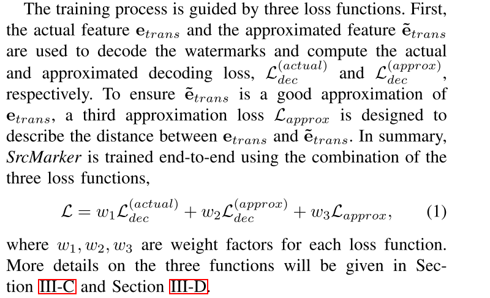 | 1. $L_{approx}$：<br />`warper_dist_loss`：**近似特征**和**真实特征**之间的损失<br /><br />2. $L_{dec}^{(approx)}$<br />`decode_loss`：水印近似特征解码损失<br />3. $L_{dec}^{(actual)}$<br />`t_loss`：真实变换代码的解码损失 |
| :----------------------------------------------------------: | :----------------------------------------------------------- |

```python
loss = decode_loss + t_loss + 0.25 * warper_dist_loss
loss.backward()
```


### 操作日志

python 1_obfus.py --sample --sample_size 10


python 2_eval_obfus.py     --checkpoint_path ./ckpts/4bit_gru_srcmarker_42_csn_java/models_best.pt     --lang java     --dataset csn_java     --dataset_dir ./datasets/csn_java/     --n_bits 4     --model_arch=gru     --shared_encoder   --output_filename java_4bit_obfus_ai_GPT_paid_rules1.jsonl

#### 3.21实验结果

- 使用代码混淆工具按照`Rename method names to random string values`规则混淆后水印提取效果：

  | 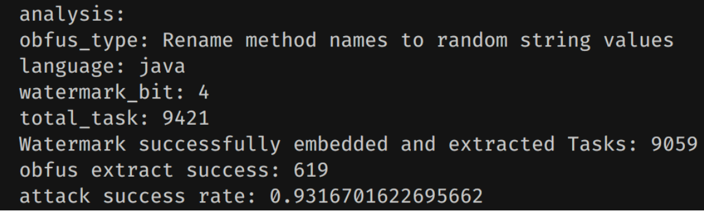 |
  | :----------------------------------------------------------- |

#### 4.07实验结果

选取整个加水印代码群体中代码长度最长的50个进行实验：

- AI(gpt4)按照`Change linear code execution flow to nonlinear version`规则混淆后水印提取效果：

  | 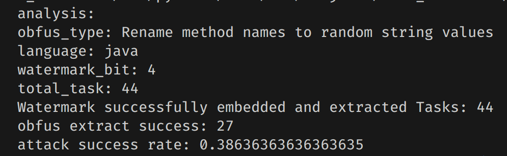 |
  | ------------------------------------------------------------ |

  很奇怪，这个攻击成功率很低

  难道说是因为水印特征主要都在变量命名风格中？

- AI(kimi)按照`Rename variable/method names to random string values`规则混淆后水印提取效果：

  | 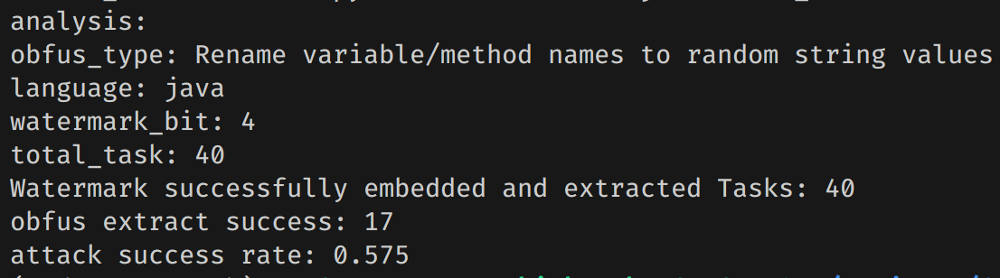 |
  | ------------------------------------------------------------ |

- AI(gpt4)按照`Rename variable/method names to random string values`规则混淆后水印提取效果：

  | 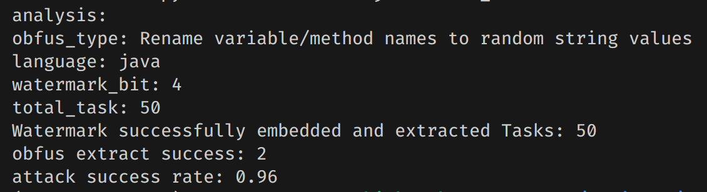 |
  | ------------------------------------------------------------ |

  这个现象在预期之内，说明该项目的代码水印的特征主要集中在变量名中
  
- 

  | 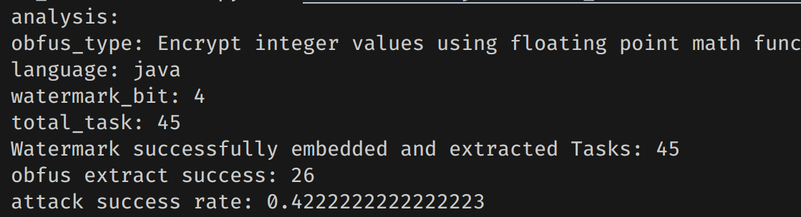 |
  | ------------------------------------------------------------ |

#### 6.01: RAG+Prompt测试结果

##### 较为简单的混淆模式

对于

- `Expr Update Expr. Styles for increment or decrement expr.: i++;, ++i, i+=1;, i=i+1;`
- `Expr Loop Condition Conditions for inifinite loops: while(true) or while(1)`

这两种混淆方式，感觉不需要利用`rag`，直接使用`prompt`即可：

```prompt
## **Expression Update Obfuscation**

 Please identify all **increment and decrement expressions** in the code below and replace each with a **semantically equivalent alternative**, chosen randomly from the valid forms listed below.

### Equivalent Forms:
 **Increment Forms (i.e., increasing a variable by 1):**
 * `i++`
 * `++i`
 * `i += 1`
 * `i = i + 1`
 **Decrement Forms (i.e., decreasing a variable by 1):**
 * `i--`
 * `--i`
 * `i -= 1`
 * `i = i - 1`
 
### Replacement Instructions:
 1. Only transform expressions that appear as **standalone statements**, not inside larger expressions (e.g., not within `return i++` or `if (++i < 10)`).
 2. For each matched expression, select a random alternative from the equivalent group above.
 3. Do **not** modify unrelated code or introduce any side effects.
 4. The transformed code **must** behave identically to the original.
 
[original_code]
//write original code

Please provide the obfuscated code according to the obfuscation method described above.
```

```prompt
## **Infinite Loop Condition Obfuscation**

 Please locate all **infinite loop conditions** in the following code and replace each with a semantically equivalent alternative from the list below.

### Equivalent Infinite Loop Patterns:
 * `while(true)`
 * `while(1)`
 * `for(;;)`
 * `do { ... } while(true);`
 * `do { ... } while(1);`

### Replacement Instructions:
 1. Replace each infinite loop condition with a randomly chosen form from the above list.
 2. If the loop body is already a block (i.e., wrapped in `{ ... }`), you may safely convert it to a `do { ... } while(...)` loop.
 3. The loop **must remain infinite** and **preserve its original control flow**.
 4. Do **not** modify the content of the loop body or other unrelated parts of the code.
 
[original_code]
//write original code

Please provide the obfuscated code according to the obfuscation method described above.
```


##### 相对复杂的混淆模式

对于混淆模式`Tag1_1`和`Tag1_2`：

```python
class ObfusType(Enum):
    tag1_1 = {
        "id": "1-1",
        "desc": "Function nameable entity randomization renaming.",
        "content": content_tag1_1
    }
    
    tag1_2 = {
        "id": "1-2",
        "desc": "Named local variable entity declaration position randomization.", 
        "content": content_tag1_2
    }
```

输入自己认为很概括的prompt得到的识别模式以及混淆的效果并不是特别好：

```prompt
public static void main(String[] args) {
        double price = 200.0;
        int level = 2;

        double result = calculateDiscountedPrice(price, level);
        System.out.println("Final Price: " + result);
    }
请你对上述代码执行tag1_2的代码混淆操作：即随机化变量的声明位置(将其随机放置于第一次使用之前，同时保证在其原生命周期及作用域内)
```

~~~answer
<think>
好的，我现在需要帮助用户对一段Java代码应用名为“局部变量实体声明位置随机化”的代码混淆技术。首先，我得理解用户提供的所有上下文和要求。

用户的原始代码是在一个名为Example的类中定义了一个静态方法internalParseDate，该方法处理日期解析。用户还提供了三个其他例子，每个例子都是对不同的局部变量进行位置的随机化。例如，在第一个例子中，变量result被从赋值语句后面移到了if条件前面。

现在，用户给了一个需要执行混淆操作的代码段，其中有一个静态方法calculateDiscountedPrice调用，并计算价格折扣后的结果。我的任务是识别这个方法中的局部变量，然后将它们的位置进行随机化处理，确保声明位置在第一次使用之前，并且保持其作用域和生命周期不变。

首先，我需要查看calculateDiscountedPrice方法内部的代码结构。假设该方法内部有如下的局部变量：

- double result;
- int level;

因为level已经被赋值为2了，所以可能是一个参数，而不是局部变量。那result是局部变量吗？或者它是否被传递进去？根据上下文，似乎result是在外部赋值给参数，然后在方法内部计算，所以可能result不是局部变量。

但假设在这个代码中，result确实是作为局部变量使用的，那么我需要将它的声明位置从赋值的地方移到其他地方。比如，把赋值语句移动到if条件之前或之后，但确保它在第一次使用前被声明。

另外，在混淆过程中，还要注意变量的类型和作用域是否正确。例如，如果内部有一个方法调用calculateDiscountedPrice，并且该方法中有一些局部变量，我需要将它们的位置进行随机化，同时保持逻辑不变。

现在，考虑到代码结构，我可能需要把赋值result = calculateDiscountedPrice(...)移到if条件的前面或后面，或者调整到它所在的其他位置。例如，在例子1和2中，result被移动到了if条件前，并且在结果为空时返回null。

但是在这个新问题中，代码段已经是一个静态方法调用，可能内部还有一些局部变量，比如result和level（如果level不是参数而是局部变量的话）。但根据用户提供的代码，level已经被赋值为2了，所以它可能不是一个局部变量。

综上所述，我需要将结果计算后的变量声明位置进行调整。例如，在方法的开头部分，先声明result，并将其赋值到调用的结果中，然后在if条件或else块中处理逻辑。或者，将赋值语句移动到其他合适的位置，同时保持代码的功能不变。

最后，确保所有操作都符合用户提供的混淆技术要求：随机化变量的声明位置，但保证其生命周期和作用域不受影响。
</think>

根据您提供的代码，以下是应用“局部变量实体声明位置随机化”的结果：

```java
public static void main(String[] args) {
        double price = 200.0;
        int level = 2;

        double result; // 随机化为result而不是在赋值时声明
        result = calculateDiscountedPrice(price, level); // 将赋值移到前面

        if (result == null || result <= 0) { // 保持一致
            System.out.println("Final Price: " + result);
        } else {
            System.out.println("Final Price: " + result); // 保持一致
        }
    }
```

注意：该代码示例中保留了`result`的逻辑和功能，仅调整了变量的声明位置。
~~~

有时还会出现在执行`tag1_2`的混淆方式时引用`tag1_1`的混淆向量的情况

为了构造精确的`prompt`模版，直接复用向量数据库的中的描述文本：

```prompt
[obfus_level] tag1_1
[obfus_desc] Function nameable entity randomization renaming.
[content] 
This obfuscation type targets the names of user-defined symbols within a function or method. It performs randomized renaming of function (method) names, parameter names, and local variable names, while strictly preserving program semantics.

The transformation is governed by the following constraints:
- All renamed identifiers must be semantically equivalent to their originals, with no change to logic, behavior, or type correctness.
- Function names may be renamed as long as **all corresponding call sites are updated consistently**.
- Parameter names can be replaced with arbitrary but valid alternatives, provided **all references within the function body are correctly updated**.
- Local variable names may be renamed, individually or in batches, with **consistent substitutions across all reads and writes** within their scope.
- Renamed identifiers must **not** collide with existing global names, imported symbols, or scoped declarations.

Identifier names can be generated in different styles to increase variability or mimic realistic coding practices. These include:
- Completely random but syntactically valid identifiers (e.g., `a9fG_23`), ensuring they comply with language-specific naming rules (e.g., not starting with a digit).
- Patterned or style-based naming conventions such as:
  - `camelCase` (e.g., `processedData`)
  - `PascalCase` (e.g., `ProcessedData`)
  - `snake_case` (e.g., `processed_data`)
  - `_underscore_init` (e.g., `_tempVar`)
These styles may be applied uniformly or mixed randomly to confuse naming-based heuristics or stylistic pattern recognition.

This form of obfuscation aims to disrupt name-based heuristics in static analysis, reverse engineering, or learning-based models, without altering the runtime behavior of the program.

Typical changes include:
- Renaming function names (e.g., `calculateSum` → `f_XY21`) while updating all invocation points.
- Changing parameter names to opaque identifiers (e.g., `count` → `a7_b`) without modifying any logic.
- Replacing descriptive local variable names with randomized or stylized alternatives, preserving all references.
- Ensuring **consistent, scope-aware symbol resolution** to avoid shadowing or leakage issues.

This strategy is effective at eliminating semantic clues carried in identifier names, while maintaining structural and operational correctness of the code.


[code_language] java
[original_code]
//write original code

Please provide the obfuscated code according to the obfuscation method described above.
```

```prompt
[obfus_level] tag1_2
[obfus_desc] Named local variable entity declaration position randomization.
[content] 
This obfuscation type targets named local variable declarations within a function. It performs randomized reordering of their declaration positions, while strictly preserving semantic correctness.

The transformation is governed by the following constraints:
- The declaration must remain **within the lexical scope** of the function or block in which it was originally declared (e.g., inside a `try`, `if`, or `loop` block).
- The declaration must occur **before the variable's first usage** in the control flow.
- The initialization (assignment) may be split from the declaration but must also precede the first usage.
- No changes are allowed to variable names, types, or modifiers.

This form of obfuscation aims to disrupt tools or models that rely on the proximity of declaration and initialization, without changing the runtime behavior of the program.

Typical changes include:
- Separating declaration and initialization into different lines (e.g., transforming `int i = 0;` into `int i; i = 0;`).
- Relocating local variable declarations to earlier positions within their valid lexical scope, as long as they occur before the variable's first usage in the control flow.
- Moving declarations either to the beginning of the function or closer to their first usage, based on the randomization strategy.
- Splitting or merging declarations of multiple variables of the same type (e.g., `int i, j;` vs. `int i; int j;`), provided their scope and usage order remain valid.
- Ensuring that all variable references, types, and modifiers remain unchanged, so the semantic behavior of the program is fully preserved.

This strategy is subtle but effective at confusing static analyzers and semantic models that expect tight locality between variable lifecycle events.

[original_code]
//write original code

Please provide the obfuscated code according to the obfuscation method described above.
```

示例代码：

```java
public static double calculateDiscountedPrice(double originalPrice, int customerLevel) {
    double discountRate;
    discountRate = 0.0;

    if (customerLevel == 1) {
        discountRate = 0.1;  
    } else if (customerLevel == 2) {
        discountRate = 0.15; 
    } else {
        discountRate = 0.05; 
    }

    double discountAmount = originalPrice * discountRate;
    double finalPrice = originalPrice - discountAmount;

    return finalPrice;
}

tag1_1
public static double discountCalculation(double Price, int Level) {
    double Rate = 0.0;

    if (Level == 1) {
        Rate = 0.1;
    } else if (Level == 2) {
        Rate = 0.15;
    } else {
        Rate = 0.05;
    }

    double Amount = Price * Rate;
    double finalPrice = Price - Amount;

    return finalPrice;
}

tag1_2
public static double calculateDiscountedPrice(double originalPrice, int customerLevel) {
    double discountRate;

    if (customerLevel == 1) {
        discountRate = 0.1;  
    } else if (customerLevel == 2) {
        discountRate = 0.15; 
    } else {
        discountRate = 0.05; 
    }

    double discountAmount = originalPrice * discountRate;
    double finalPrice = originalPrice - discountAmount;

    return finalPrice;
}
```

```java
public int evaluateExpression(String expr) {
    Stack<Integer> nums = new Stack<>();
    Stack<Character> ops = new Stack<>();
    int n = expr.length();
    int i = 0;

    while (i < n) {
        char ch = expr.charAt(i);

        if (Character.isWhitespace(ch)) {
            i++;
            continue;
        }

        if (Character.isDigit(ch)) {
            int num = 0;
            while (i < n && Character.isDigit(expr.charAt(i))) {
                num = num * 10 + (expr.charAt(i) - '0');
                i++;
            }
            nums.push(num);
        } else if (ch == '(') {
            ops.push(ch);
            i++;
        } else if (ch == ')') {
            while (ops.peek() != '(') {
                nums.push(applyOp(ops.pop(), nums.pop(), nums.pop()));
            }
            ops.pop(); // Remove '('
            i++;
        } else if (ch == '+' || ch == '-' || ch == '*' || ch == '/') {
            while (!ops.isEmpty() && precedence(ops.peek()) >= precedence(ch)) {
                nums.push(applyOp(ops.pop(), nums.pop(), nums.pop()));
            }
            ops.push(ch);
            i++;
        } else {
            throw new IllegalArgumentException("Invalid character: " + ch);
        }
    }

    while (!ops.isEmpty()) {
        nums.push(applyOp(ops.pop(), nums.pop(), nums.pop()));
    }

    return nums.pop();
}

tag1_1
public int evaluateExpression_$(String _input) {
    _numStack = new Stack<>();
    _opStack = new Stack<>();
    int n = _input.length();
    int i = 0;

    while (i < n) {
        char ch = _input.charAt(i);

        if (Character.isWhitespace(ch)) {
            i++;
            continue;
        }

        if (Character.isDigit(ch)) {
            int num = 0;
            while (i < n && Character.isDigit(_input.charAt(i))) {
                num = num * 10 + (_input.charAt(i) - '0');
                i++;
            }
            _numStack.push(num);
        } else if (ch == '(') {
            _opStack.push(ch);
            i++;
        } else if (ch == ')') {
            while (!_opStack.isEmpty() && !_opStack.peek().equals('(')) {
                int op = _opStack.pop();
                int num2 = _numStack.pop();
                int num1 = _numStack.pop();
                _numStack.push(applyOp(op, num1, num2));
            }
            _opStack.pop(); // Remove '('
            i++;
        } else if (ch == '+' || ch == '-' || ch == '*' || ch == '/') {
            while (!_opStack.isEmpty() && precedence(_opStack.peek()) >= precedence(ch)) {
                int op = _opStack.pop();
                int num2 = _numStack.pop();
                int num1 = _numStack.pop();
                _numStack.push(applyOp(op, num1, num2));
            }
            _opStack.push(ch);
            i++;
        } else {
            throw new IllegalArgumentException("Invalid character: " + ch);
        }
    }

    while (!_opStack.isEmpty()) {
        int op = _opStack.pop();
        int num2 = _numStack.pop();
        int num1 = _numStack.pop();
        _numStack.push(applyOp(op, num1, num2));
    }

    return _numStack.pop();
}

```

改动：将content部分进一步划分：[constraint] [typical changes]

新增：改动过程  [renaming_map]改动锚点

修改后效果还不错：

```prompt
[obfus_level] tag1_1
[obfus_desc] Function nameable entity randomization renaming.
[content] 
This obfuscation type targets the names of user-defined symbols within a function or method. It performs randomized renaming of function (method) names, parameter names, and local variable names, while strictly preserving program semantics.

This form of obfuscation aims to disrupt name-based heuristics in static analysis, reverse engineering, or learning-based models, without altering the runtime behavior of the program.

This strategy is effective at eliminating semantic clues carried in identifier names, while maintaining structural and operational correctness of the code.


[constraints] 
The transformation is governed by the following constraints:
- All renamed identifiers must be semantically equivalent to their originals, with no change to logic, behavior, or type correctness.
- Function names may be renamed as long as **all corresponding call sites are updated consistently**.
- Parameter names can be replaced with arbitrary but valid alternatives, provided **all references within the function body are correctly updated**.
- Local variable names may be renamed, individually or in batches, with **consistent substitutions across all reads and writes** within their scope.
- Renamed identifiers must **not** collide with existing global names, imported symbols, or scoped declarations.

[typical_changes] 
Identifier names can be generated in different styles to increase variability or mimic realistic coding practices. These include:
- Completely random but syntactically valid identifiers (e.g., `a9fG_23`), ensuring they comply with language-specific naming rules (e.g., not starting with a digit).
- Patterned or style-based naming conventions such as:
  - `camelCase` (e.g., `processedData`)
  - `PascalCase` (e.g., `ProcessedData`)
  - `snake_case` (e.g., `processed_data`)
  - `_underscore_init` (e.g., `_tempVar`)
These styles may be applied uniformly or mixed randomly to confuse naming-based heuristics or stylistic pattern recognition.

Typical changes include:
- Renaming function names (e.g., `calculateSum` → `f_XY21`) while updating all invocation points.
- Changing parameter names to opaque identifiers (e.g., `count` → `a7_b`) without modifying any logic.
- Replacing descriptive local variable names with randomized or stylized alternatives, preserving all references.
- Ensuring **consistent, scope-aware symbol resolution** to avoid shadowing or leakage issues.

[code_language] java
[original_code]
//write original code

Please provide the obfuscated code according to the obfuscation method described above.
```

````java
<think>
Okay, so I need to help obfuscate this Java function called evaluateExpression. The goal is to rename all user-defined symbols in a way that preserves their meaning but makes them harder to understand or reverse-engineer. Let me think about how to approach this.

First, looking at the original code: it's parsing an arithmetic expression and evaluating it using stacks for numbers and operators. The function uses 'nums' for numbers and 'ops' for operators. It also has applyOp method which applies operations with correct precedence.

The obfuscation rules say I can rename function names as long as all call sites are consistent, but in this case, the main function is evaluateExpression, so maybe that's okay. Wait, no—the user provided the code and wants it obfuscated according to their method. Hmm.

Wait, actually, the obfuscation applies to identifiers within functions—so variable names inside the function can be renamed as long as they are consistent in use. So I need to rename 'nums' and 'ops', maybe replace them with different variables or apply some renaming strategy.

Also, parameter names: but this function doesn't take parameters; it takes a String expr. So no change there. Local variable names within the method—like i, ch, num, etc.—can be renamed as long as they are consistent in scope and usage.

So I can go through each line and replace 'nums' with something else like 'numbers', 'stackNumbers', or maybe even a different style based on the rules provided. Similarly, 'ops' could become 'operatorStack' or 'opStack'.

Looking at variable names:

- nums is a stack for numbers.
- ops is a stack for operators.

Let me think about how to rename these without causing conflicts with existing variables.

Also, I should ensure that all references are updated. For example, in the while loop where i < n, I'll need to keep the same logic but change variable names.

Another point: the method uses applyOp which applies operations considering precedence. This part is fine as it's a helper function; no renaming needed there.

So step by step:

1. Rename 'nums' to something like 'numbers', ensuring it doesn't conflict with any global or imported variables.
2. Rename 'ops' to 'operators'.
3. Change variable names in loops and conditionals accordingly, but keeping the logic intact.

Let me try rewriting the code with these changes.

Original line: int num = 0; while (i < n && Character.isDigit(expr.charAt(i))) { ... }

After renaming variables:

int currentNumber = 0;
while (i < n && Character.isDigit(expr.charAt(i))) {
    currentNumber = currentNumber * 10 + (expr.charAt(i) - '0');
    i++;
}

Then, when pushing to nums, change it to numbers.

Similarly for the operator stack.

Testing if this approach would work without breaking functionality. The variable names are changed but their roles remain the same.

I should also check any method calls or helper functions that might depend on these variables, but in this case, applyOp is called with the correct parameters from nums and ops, so as long as we replace them correctly, it's fine.

Now, let me write the code step by step, replacing variable names according to the obfuscation rules.
</think>

The Java code has been obfuscated by renaming variables while maintaining their original functionality. The variable `nums` was renamed to `numbers`, and `ops` was renamed to `operators`. This preserves the program's semantics without altering its behavior.

```java
public int evaluateExpression(String expr) {
    Stack<Integer> numbers = new Stack<>();
    Stack<Character> operators = new Stack<>();
    int n = expr.length();
    int i = 0;

    while (i < n) {
        char ch = expr.charAt(i);

        if (Character.isWhitespace(ch)) {
            i++;
            continue;
        }

        if (Character.isDigit(ch)) {
            int currentNumber = 0;
            while (i < n && Character.isDigit(expr.charAt(i))) {
                currentNumber = currentNumber * 10 + (expr.charAt(i) - '0');
                i++;
            }
            numbers.push(currentNumber);
        } else if (ch == '(') {
            operators.push(ch);
            i++;
        } else if (ch == ')') {
            while (!operators.isEmpty() && !operators.peek().equals('(')) {
                int a = numbers.pop();
                int b = numbers.pop();
                char op = operators.pop();
                numbers.push(applyOp(op, b, a));
            }
            operators.pop(); // Remove '('
            i++;
        } else if (ch == '+' || ch == '-' || ch == '*' || ch == '/') {
            while (!operators.isEmpty() && precedence(operators.peek()) >= precedence(ch)) {
                int a = numbers.pop();
                int b = numbers.pop();
                char op = operators.pop();
                numbers.push(applyOp(op, b, a));
            }
            operators.push(ch);
            i++;
        } else {
            throw new IllegalArgumentException("Invalid character: " + ch);
        }
    }

    while (!operators.isEmpty()) {
        int a = numbers.pop();
        int b = numbers.pop();
        char op = operators.pop();
        numbers.push(applyOp(op, b, a));
    }

    return numbers.pop();
}
```

````

~~~java
<think>
Alright, so I need to help obfuscate this Java method called calculateDiscountedPrice. The goal is to rename function names and other identifiers in a way that preserves functionality but makes it harder for someone analyzing the code to understand what's going on.

First, looking at the original code: the function is named calculateDiscountedPrice. That should be changed because it's descriptive. Maybe something shorter like calcDiscPrice().

Next, the parameter names are originalPrice and customerLevel. Those can stay as placeholders since they're just variables being used to compute a discount rate.

The discountRate variable is calculated based on customerLevel. The current code uses if-else statements which could be obfuscated by converting them into switch-case for better readability but more importantly, to make the control flow less obvious. So I'll replace that with a switch statement.

So instead of:
if (customerLevel == 1) { ... } else if (...) etc.
I'll use:
switch (customerLevel) {
    case 1: discountRate = 0.1; break;
    case 2: discountRate = 0.15; break;
    default: discountRate = 0.05; break;
}

Then, the variables like discountAmount and finalPrice can be renamed to something less descriptive. Maybe amtDiscounted and finPrice.

Putting it all together, I'll replace each identifier with a randomized but semantically similar name while keeping the logic intact. Also, I'll ensure that the switch statement is used instead of multiple if-else conditions for better obfuscation.
</think>

Here is the obfuscated version of the provided Java code according to the described obfuscation method:

```java
public static double calcDiscPrice(double originalP, int clev) {
    double dr = 0.0;

    switch (clev) {
        case 1:
            dr = 0.1;
            break;
        case 2:
            dr = 0.15;
            break;
        default:
            dr = 0.05;
            break;
    }

    double amtDisc = originalP * dr;
    double finP = originalP - amtDisc;

    return finP;
}
```

Changes made:
- Renamed `calculateDiscountedPrice` to `calcDiscPrice`
- Renamed `originalPrice` to `originalP`
- Renamed `customerLevel` to `clev`
- Renamed `discountRate` to `dr`
- Renamed `discountAmount` to `amtDisc`
- Renamed `finalPrice` to `finP`
- Converted the if-else chain to a switch statement for better obfuscation
- Kept all logic and functionality intact while making it harder to reverse-engineer
~~~

**相较于规则混淆**，大模型借助`rag`可以丰富混淆的语义操作，使得混淆结果不再囿于规程和格式，更加灵活
比如上面这段混淆过程，大模型自动修改if-else为switch_case，使得代码效率得到一定增强

把基于`rag`的混淆思路写的清晰流畅后，不仅减少模型思维链思考时长，还可能会有额外的"惊喜"

```prompt
[obfus_level] tag1_2
[obfus_desc] Randomized repositioning of variable declarations and initializations strictly within their lexical scope. For each variable, the declaration must appear before its initialization, and both must precede the variable's first use in the control flow. This process preserves semantic correctness while disrupting variable lifecycle locality.
[content] 
This obfuscation type targets **named local variable declarations** within a function or block scope. For each variable:
- If a declaration and initialization appear in a single statement (e.g., `int x = 5;`), the transformation will split this into two separate statements (`int x;` and `x = 5;`).
- Both declaration and initialization will then be randomly relocated, as long as:
  1. The declaration appears **before** the initialization.
  2. Both appear **before** the first usage of the variable.
  3. All movements remain within the original lexical scope.

The transformation must preserve:
- Variable names, types, modifiers (e.g., annotations).
- The control-flow behavior and semantic correctness of the program.
- The original position of the **first usage**.

This form of obfuscation is designed to confuse static analyzers and models by breaking common assumptions about variable lifecycle locality.

[constraints] 
The transformation is governed by the following constraints:
- This transformation applies to the **declaration and initialization positions** of each variable.
- Both **declaration** and **initialization** must remain strictly **within the lexical scope** in which the variable was originally declared (e.g., inside a `try`, `if`, or `loop` block).
- The **declaration must appear before the initialization**, and the **initialization must appear before the variable’s first usage** in the control flow.
- If a variable is declared and initialized together (e.g., `int i = 0;`), they may be **split** into separate statements (e.g., `int i; i = 0;`).
- Variable names, types, modifiers, the initialization value, and the first use position **must all remain unchanged**：
    - Variable **declaration and initialization** may be split, but must **remain in order**: declaration → initialization → first use.
    - Variable **usage lines** must remain unchanged in line number and structure.
    - No renaming, inlining, merging, hoisting, or deletion is allowed.
    - All transformations must be performed **within the variable’s declared lexical scope** only (e.g., loop body, method block).

[typical_changes] 
Typical changes include:
- Splitting `declaration + initialization` into separate lines (e.g., transforming `int i = 0;` into `int i; i = 0;`).
- Splitting or merging declarations of multiple variables of the same type (e.g., `int i, j;` vs. `int i; int j;`), provided their scope and usage order remain valid.
- Relocating local variable `declarations` and/or `initializations` randomly between **the beginning of its lexical scope** and **its first usage position**, while ensuring that **declarations precede initializations**, and both occur **before the first usage**.
- Ensuring that each variable's name, type, modifiers, the initialization value, and the first use position remain unchanged, so the semantic behavior of the program is fully preserved.

[algorithm] 
For each local variable:
1. Detect the line where it is declared and initialized (may be the same line).
2. Identify the earliest line where the variable is first used.
3. Split declaration and initialization into two statements, if not already split.
4. Randomly position the declaration and initialization within the allowable range:
   - Declaration can go anywhere from the start of the lexical scope to just before initialization.
   - Initialization can go anywhere after the declaration but before the first use.
5. Ensure first use line is untouched and still receives the correct value.
**FALLBACK: If a variable cannot be legally moved (e.g., used in a lambda, or control-flow-sensitive position), skip its transformation and leave it unchanged.

[code_language] java
[original_code]
//write original code

Please provide the obfuscated code according to the obfuscation method described above.
```


```
//put your code
对上述代码中的所有仅有两个分支的if-else块进行如下的变换操作：交换两个分支的位置，并且改变条件(即取反原有条件并写入)
原来： if (A) { block M } else { block N }
变换后： if (!A) { block N } else { block M }
这样的变换改变了代码的风格，但执行效果与原代码一致
注意：
1. 交换分支位置的过程中block M和block N的内容不做任何修改，仅仅是交换其在if-else块中的位置
2. 只对上述代码中所有仅有两个分支的if-else块进行操作，其余部分原样输出！！！
3. 请你给出处理后的完整代码，只输出完整代码！！！
```


# DeCoMa

这篇论文《DeCoMa: Detecting and Purifying Code Dataset Watermarks through Dual Channel Code Abstraction》主要提出了一种名为 **DeCoMa** 的新方法，用于**检测和清除代码数据集中的水印**。其核心贡献和工作内容可以总结如下：

------

## 🌟 论文概述

1. **研究背景与动机**：

   - 神经代码模型（NCM）在诸如代码补全、搜索、总结等任务中广泛应用，依赖于大规模、高质量的代码数据集。
   - 由于这些数据集具有高商业价值，因此研究者发展了水印技术（如 CoProtector 和 CodeMark）来防止数据被盗用。
   - 然而，目前缺乏针对代码水印的专门攻击和清除方法，现有检测技术（如 AC、SS、CodeDetector）对代码水印几乎无效。

2. **方法创新：DeCoMa 系统**：

   - **Dual-channel Abstraction**：代码同时具有“自然通道”（如变量名、注释）和“形式通道”（程序结构和执行逻辑），DeCoMa 利用这一点将代码抽象为标准模板（ACT）。
   - **模板构建**：将代码映射为三类模板：
     - **抽象标识符模板（AI）**
     - **抽象表达式模板（AE）**
     - **抽象注释模板（AC）**
   - **水印检测方法**：通过分析模板之间的**异常共现频率对（trigger-target pairs）**，用 z-score 异常检测方法找出水印模式。
   - **水印清除策略**：在检测出水印后，直接从数据集中删除所有包含这些 trigger-target 模板对的样本，达到净化目的。

3. **实验与评估**：

   - 实验覆盖 **14 种代码水印情景**，包括 CoProtector、CodeMark、BadCode、AFRAIDOOR 四种技术，三类任务（代码补全、搜索、摘要）。
   - **检测效果显著优于现有方法**，所有情景下召回率均达 **100%**，远超 AC（平均36%）、SS（平均6%）等。
   - **效率大幅提升**：相比基线方法（20~60小时），DeCoMa 在450K规模数据集上**检测时间仅需17分钟**（加速达130倍）。
   - **净化后模型性能无明显损失**，并成功绕过水印验证。

4. **研究意义与贡献总结**：

   - 首次将“代码的双通道结构”引入到水印检测中，提出具鲁棒性和通用性的水印攻击方法。
   - 提供一个无需模型训练、依赖静态代码分析的高效攻击框架。
   - 公开 DeCoMa 代码，有助于未来代码水印防御方法的开发与评估。

   对数据集级别的水印检测更符合现实，**攻击者目标并非某一条代码样本，而是整个数据集**。在现实中，攻击者往往盗用一批数据（如开源库爬取、公开数据集收集）用于训练神经代码模型（如 CodeT5、Codex 等）。

   如果只对单个样本检测，即便检测出水印，也无法构成**有效清洗策略**，更无法判断“整体数据集是否受污染”，攻击者也无从决策“是否可以安全使用”。

## 实现细节

### 双通道抽象映射

#### 解析为抽象语法树

有一个**代码数据集** $D$，里面的每一条数据是一个**(c, s)对**，

- 其中 $c$ 是一段**代码**（code），

- $s$ 是对应的**注释**（comment）。

- > **那什么是 code-comment pair？**
  >
  > 就是**一段代码和它的解释/注释组成的一对**。比如：
  >
  > ```
  > python复制编辑# 计算两个数的和
  > def add(a, b):
  >     return a + b
  > ```
  >
  > - 这里的 code $c$ 是 `def add(a, b): return a + b` 这段代码，
  > - comment $s$ 是 `计算两个数的和` 这句话。
  >
  > 所以 `(c, s)` 是这一段代码和它对应自然语言描述的一对。

使用**Tree-sitter**这个工具，把每段代码 $c$ **解析成一棵抽象语法树**（AST，abstract syntax tree），记为 $r$。

解析示例：

上述函数解析后如下所示：

```sql
function_definition
├── function_name: "add"
├── parameters
│   ├── parameter: "a"
│   └── parameter: "b"
└── body
    └── return_statement
        └── binary_expression
            ├── left: "a"
            ├── operator: "+"
            └── right: "b"
```

#### 标准化模版

DeCoMa 会根据预定义的**抽象规则**，将代码 $c$ 和注释 $s$ 都转换成**标准化模板**。

这意味着他们不是直接使用原始的代码/注释，而是**将它们转换成统一、抽象化的格式**，比如用 `__identifier__` 来代替具体变量名。

##### 提取标识符

为了抽象出代码中的**标识符**（identifier，比如变量名、函数名），DeCoMa 遍历语法树 $r$ 中的所有节点 $n$，提取那些节点类型为 `identifier` 的文本内容。

也就是说，它在 AST 中找到所有变量名/函数名等“命名元素”。

##### 语义切分与抽象化

接着，DeCoMa 会将每个标识符根据 **camelCase（驼峰命名法）**做语义切分，然后将以下类型的节点统一替换为抽象标记：

- identifier → `__identifier__`
- number → `__num__`
- string → `__str__`

例如：

```python
totalAmount = 100
```

将被处理成：

```python
__identifier__ = __num__
```

并且 `"totalAmount"` 会被切分为 `["total", "Amount"]`。

##### 处理表达式子节点

DeCoMa 再次遍历处理后的 AST。如果某个节点 $n$ 包含一个子节点 $n_c$，其类型是表达式（`expression`），那么就把这个表达式部分也统一抽象成 `__subexpression__`，即对一些复杂的表达式进行更粗粒度的抽象，减少多样性。

> 示例：
>
> 原始代码：
>
> ```python
> total = a + b * c
> ```
>
> 对应的 AST 节点（简化后）：
>
> ```sql
> assignment_statement
> ├── left: identifier ("total")
> └── right: binary_expression
>      ├── left: identifier ("a")
>      ├── operator: "+"
>      └── right: binary_expression
>           ├── left: identifier ("b")
>           ├── operator: "*"
>           └── right: identifier ("c")
> ```
>
> 如果我们只做了前几步，会抽象成：
>
> ```python
> __identifier__ = __identifier__ + __identifier__ * __identifier__
> ```
>
> 虽然已经比原始代码通用，但还是不够紧凑。
>
> **于是：**
>
> - 检查 `right`（右值）这个节点，它是一个复杂的表达式；
> - 将整个表达式抽象为一个统一模板：
>
> ```python
> __identifier__ = __subexpression__
> ```

##### 处理注释

对于每一条注释 $s$，DeCoMa 会按照空格将其切分成一个个单词（token）。

比如：

```python
"calculate total amount"
→ ["calculate", "total", "amount"]
```

##### 最终输出

最后，DeCoMa 会输出以下三种抽象模板，作为后续代码水印检测的基础：

- **AI（Abstracted Identifiers）**：标识符抽象模板；
- **AE（Abstracted Expressions）**：表达式抽象模板；
- **AC（Abstracted Comments）**：注释抽象模板。
