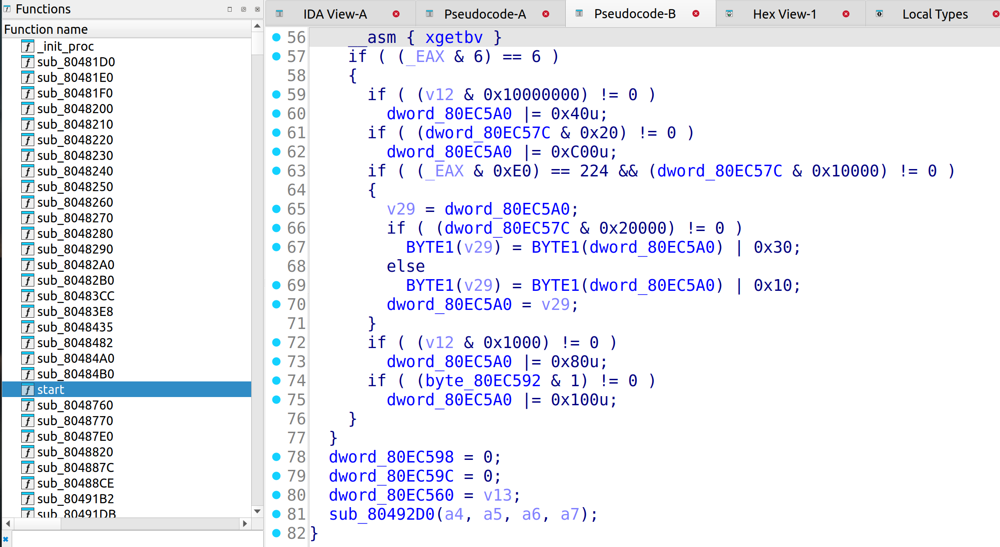
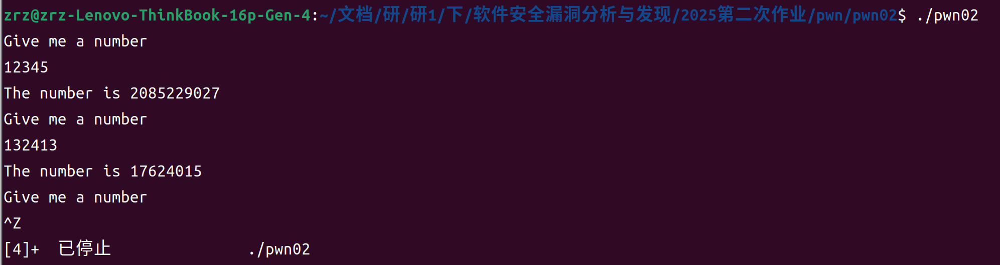
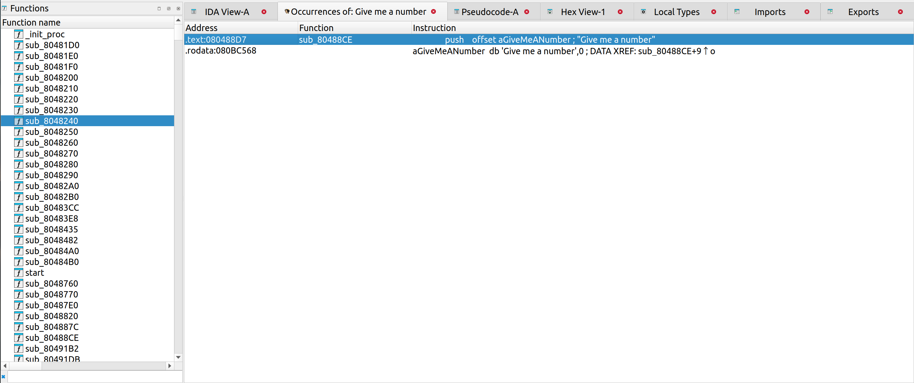
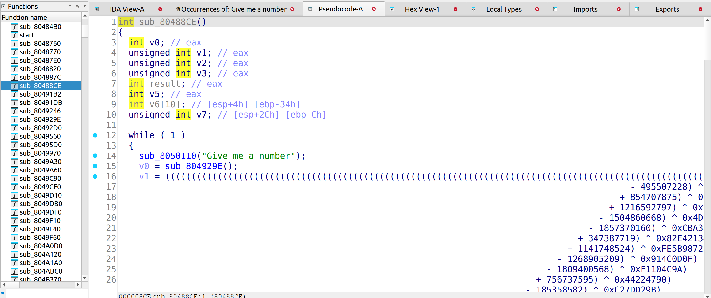
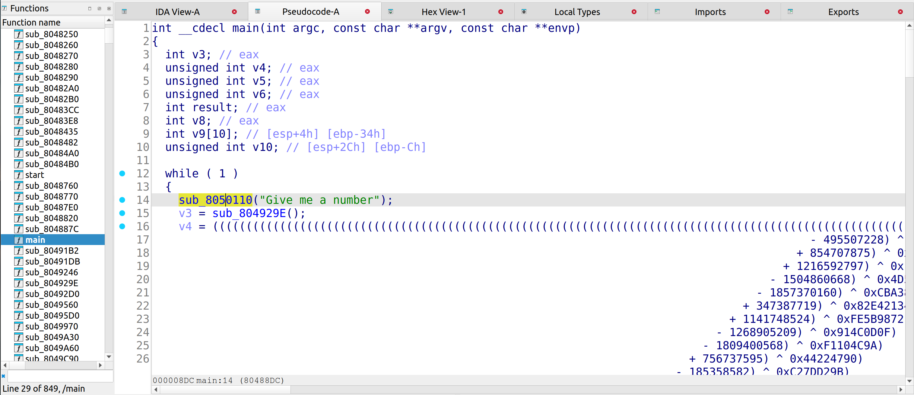
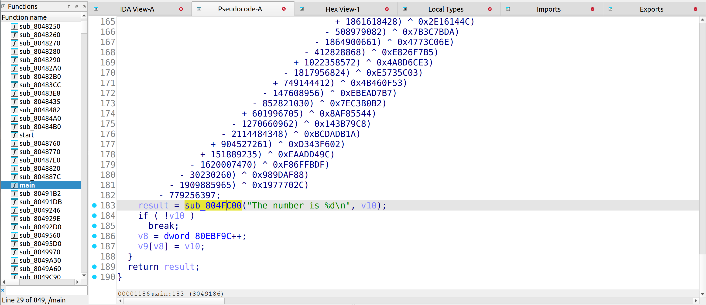
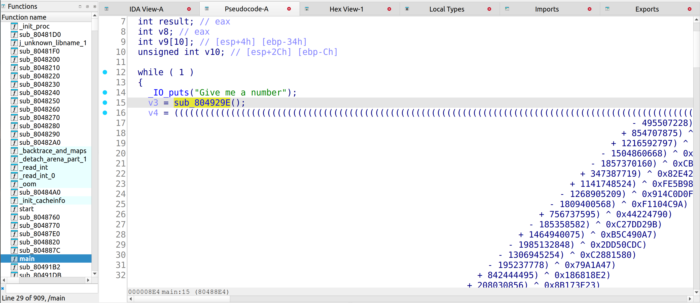

# pwn02

## 主函数入口定位

把二进制程序放到ida进行反编译后，看到了如下内容：

|  |
| ------------------------------------------------------------ |

函数基本上全是`sub_{函数起始地址}`的格式，找不到`main`函数。。。

那只能先运行一下二进制程序看有没有啥输出了：

|  |
| ------------------------------------------------------------ |

发现确实有输出，那就在`ida`里找一下`Give me a number`这个字符串：

那就`alt+t`搜一下：

|  |
| ------------------------------------------------------------ |

能在text段找到，对应函数`sub_80488CE`：

那就将其重命名为`main`函数

|  |
| ------------------------------------------------------------ |

好好好，这变量是这样初始化的

|  |  |
| ------------------------------------------------------------ | ------------------------------------------------------------ |

这俩是啥函数？和输出有关 puts&print???

|  |
| ------------------------------------------------------------ |

给`v3`赋值的这个函数是用来干什么的呢？

```c
int sub_804929E()
{
  char v1[40]; // [esp+0h] [ebp-28h] BYREF

  sub_80491DB(v1, 32);
  return sub_804E290(v1);
}
int __cdecl sub_80491DB(int a1, int a2)
{
  int i; // [esp+Ch] [ebp-Ch]

  for ( i = 0; a2 - 1 > i; ++i )
  {
    if ( __libc_read(0, i + a1, 1) != 1 )
      exit(1);
    if ( *(_BYTE *)(i + a1) == 10 )
      break;
  }
  *(_BYTE *)(i + a1) = 0;
  return i;
}
```

第二个函数问了一下`GPT`，从他调用的`__libc_read`这里也能感觉出来这是一个读取标准输入到`a1`处缓冲区的函数

所以`sub_804929E`的函数逻辑就是从标准输入读取32字节放置于栈上的`v1`数组中并使用`atoi`将其转化为整数的过程

将其重命名为`scanStr2int()`函数

## 主函数逻辑分析

`main`函数代码的整体逻辑是：

无限循环如下操作：

- 从标准输入读取字符串并将其数字部分转化为整数作为初始变量`v3=atoi(v1[0-31])`
- 该变量进行一系列操作得到变量`v10`，将其输出到标准输出
- 判断`v10`的值是否=0：
  - $\neq$0：退出循环
  - $=$0：在`v9`整数数组的索引`[v8]`处赋值`v10`，索引`v8`自增1

## 漏洞入口分析

对于栈这部分的内容主要攻击手段为栈溢出，

那我想要注入的`shellcode`的代码可以位于程序开始从标准读入读取到的`v1`数组位置

也就是说返回地址要取在`v1`数组的起始位置附近。

`v1`数组的起始位置怎么获得呢？
